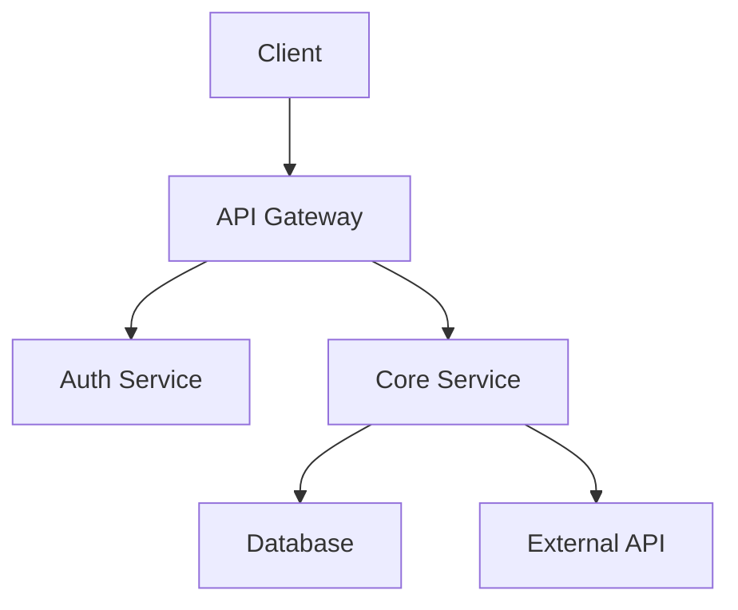

# Create Project Documentation Workflow

## Overview

This workflow guides you through creating the core set of project documentation using standardized templates. It focuses specifically on the foundational documents that define a project's purpose, technology, architecture, and requirements.

## When to Use

- When starting a new project
- When formalizing documentation for an existing project
- When updating project documentation after significant changes
- When standardizing documentation across multiple projects
- When onboarding new team members to understand the project

## Prerequisites

- Project planning completed
- Basic understanding of the project goals and scope
- Access to project stakeholders for information gathering

## Workflow Steps

### Step 1: Prepare for Documentation

**Actions:**
1. Review existing project information and materials
2. Identify key stakeholders for each document type
3. Schedule information gathering sessions if needed
4. Create a documentation directory in your project
5. Set up version control for documentation

**Setup Commands:**
```bash
# Create documentation directory structure
mkdir -p docs/project

# Initialize version control (if not already done)
git add docs/
git commit -m "Initialize project documentation structure"
```

### Step 2: Create Project Overview Document`

**Information to Gather:**
- Project name and description
- Business goals and objectives
- Target users and stakeholders
- Key features and functionality
- Success metrics and KPIs
- Project timeline and milestones

**Actions:**
1. Copy the project overview template to your documentation directory
2. Fill in each section with project-specific information
3. Add any project-specific sections needed
4. Review with project stakeholders
5. Finalize and commit the document

**Example Project Overview Structure:**
```markdown
# Project Overview: [Project Name]

## Purpose and Goals

[Describe the primary purpose of the project and its key goals]

## Target Users

[Identify and describe the primary user groups]

### User Personas

[Create brief personas for key user types]

## Key Features

[List and describe the main features of the project]

## Success Metrics

[Define how project success will be measured]

## Timeline and Milestones

[Outline major project phases and deadlines]
```

### Step 3: Create Tech Stack Document

**Information to Gather:**
- Frontend technologies and frameworks
- Backend technologies and frameworks
- Database and storage solutions
- Infrastructure and hosting details
- Third-party services and APIs
- Development tools and utilities
- Testing frameworks and tools

**Actions:**
1. Copy the tech stack template to your documentation directory
2. Document each technology component with version and purpose
3. Explain key technology decisions and trade-offs
4. Include links to official documentation
5. Review with technical team members
6. Finalize and commit the document

**Example Tech Stack Structure:**
```markdown
# Tech Stack: [Project Name]

## Frontend

- **Framework**: [Name, version] - [Purpose/role]
- **UI Library**: [Name, version] - [Purpose/role]
- **State Management**: [Name, version] - [Purpose/role]
- **Key Libraries**:
  - [Library 1]: [Purpose]
  - [Library 2]: [Purpose]

## Backend

- **Language**: [Name, version] - [Purpose/role]
- **Framework**: [Name, version] - [Purpose/role]
- **API Style**: [REST/GraphQL/etc.] - [Purpose/role]
- **Key Libraries**:
  - [Library 1]: [Purpose]
  - [Library 2]: [Purpose]

## Database

- **Primary Database**: [Name, version] - [Purpose/role]
- **Caching**: [Name, version] - [Purpose/role]
- **Data Migration**: [Name, version] - [Purpose/role]

## Infrastructure

- **Hosting**: [Provider/platform] - [Purpose/role]
- **CI/CD**: [Tools/services] - [Purpose/role]
- **Monitoring**: [Tools/services] - [Purpose/role]

## Third-Party Services

- **Authentication**: [Service] - [Purpose/role]
- **Analytics**: [Service] - [Purpose/role]
- **Other Services**: [Service] - [Purpose/role]

## Development Tools

- **IDE/Editor**: [Recommended tools]
- **Package Manager**: [Tool, version]
- **Linting/Formatting**: [Tools, configuration]

## Decision Log

| Technology Choice | Alternatives Considered | Rationale |
|-------------------|-------------------------|-----------|
| [Choice 1] | [Alternative 1], [Alternative 2] | [Explanation] |
| [Choice 2] | [Alternative 1], [Alternative 2] | [Explanation] |
```

### Step 4: Create Architecture Document

**Information to Gather:**
- System components and their relationships
- Data flow between components
- API specifications and interfaces
- Database schema and data models
- Authentication and authorization approach
- Scalability and performance considerations
- Security architecture

**Actions:**
1. Copy the architecture template to your documentation directory
2. Create diagrams illustrating system architecture
3. Document each component and its responsibilities
4. Explain key architectural decisions and patterns
5. Review with technical architects and leads
6. Finalize and commit the document

**Example Architecture Structure:**
```markdown
# Architecture: [Project Name]

## System Overview

[High-level description of the system architecture]

## Architecture Diagram



## Component Descriptions

### [Component 1]
- **Purpose**: [Description]
- **Responsibilities**: [List of responsibilities]
- **Dependencies**: [Other components it depends on]
- **Technologies**: [Technologies used]

### [Component 2]
- **Purpose**: [Description]
- **Responsibilities**: [List of responsibilities]
- **Dependencies**: [Other components it depends on]
- **Technologies**: [Technologies used]

## Data Flow

[Describe how data flows through the system]

## API Design

[Document API design principles and patterns]

## Data Model

[Describe database schema and data models]

## Security Architecture

[Document authentication, authorization, and security measures]

## Scalability Considerations

[Explain how the system scales and handles increased load]

## Architectural Decisions

| Decision | Alternatives | Rationale |
|----------|--------------|-----------|
| [Decision 1] | [Alternatives] | [Rationale] |
| [Decision 2] | [Alternatives] | [Rationale] |

### Step 5: Create Requirements Document

**Information to Gather:**
- Functional requirements
- Non-functional requirements
- User stories or use cases
- Acceptance criteria
- Constraints and limitations
- Priority and status of requirements

**Actions:**
1. Copy the requirements template to your documentation directory
2. Document all current requirements with clear descriptions
3. Prioritize requirements and indicate their status
4. Include acceptance criteria for each requirement
5. Review with product owners and stakeholders
6. Finalize and commit the document

**Example Requirements Structure:**
```markdown
# Current Requirements: [Project Name]

## Functional Requirements

### User Management

| ID | Requirement | Priority | Status | Acceptance Criteria |
|----|-------------|----------|--------|---------------------|
| FR-1 | Users must be able to register with email and password | High | Implemented | - Registration form accepts email and password<br>- Email verification is sent<br>- User can log in after verification |
| FR-2 | Users must be able to reset their password | High | Planned | - Password reset form is available<br>- Reset email is sent<br>- User can set new password |

### Content Management

| ID | Requirement | Priority | Status | Acceptance Criteria |
|----|-------------|----------|--------|---------------------|
| FR-3 | Users must be able to create new posts | High | In Progress | - Post creation form is available<br>- Form validates input<br>- Post appears in user's profile |
| FR-4 | Users must be able to edit their posts | Medium | Planned | - Edit option appears for user's own posts<br>- Changes are saved correctly |

## Non-Functional Requirements

### Performance

| ID | Requirement | Priority | Status | Acceptance Criteria |
|----|-------------|----------|--------|---------------------|
| NFR-1 | Page load time must be under 2 seconds | High | In Progress | - Measured page load time < 2s for 90% of users<br>- Tested on standard connection speeds |
| NFR-2 | System must support 1000 concurrent users | Medium | Planned | - Load testing confirms performance under load |

### Security

| ID | Requirement | Priority | Status | Acceptance Criteria |
|----|-------------|----------|--------|---------------------|
| NFR-3 | All user data must be encrypted at rest | High | Implemented | - Database encryption enabled<br>- Encryption verified in database config |
| NFR-4 | System must pass OWASP Top 10 security audit | High | Planned | - Security audit completed<br>- All critical issues addressed |

## Constraints and Limitations

- [Constraint 1]
- [Constraint 2]
- [Constraint 3]

## Future Requirements

| ID | Requirement | Tentative Priority | Planned Release |
|----|-------------|---------------------|-----------------|
| FR-10 | [Future requirement 1] | Medium | Q3 2023 |
| FR-11 | [Future requirement 2] | Low | Q4 2023 |
```

### Step 6: Review and Finalize Documentation

**Actions:**
1. Conduct a comprehensive review of all documents
2. Ensure consistency across all documentation
3. Verify all information is accurate and up-to-date
4. Check for completeness and clarity
5. Address any feedback or questions
6. Commit final versions to version control

**Review Checklist:**
- [ ] All required sections are completed
- [ ] Information is accurate and current
- [ ] Diagrams are clear and properly labeled
- [ ] Terminology is consistent across documents
- [ ] Links to external resources are working
- [ ] Formatting is consistent and readable
- [ ] No confidential information is exposed
- [ ] Documentation has been reviewed by stakeholders

**Finalization Commands:**
```bash
# Commit final documentation
git add docs/project/
git commit -m "Finalize core project documentation"

# Create a documentation release tag (optional)
git tag -a doc-v1.0 -m "Initial project documentation release"
git push origin doc-v1.0
```

### Step 7: Share and Maintain Documentation

**Actions:**
1. Share documentation with the team
2. Introduce documentation in team meetings
3. Set up a maintenance schedule
4. Assign documentation ownership
5. Plan for regular updates

**Sharing Methods:**
- Add documentation links to project README
- Share in team communication channels
- Include in onboarding materials
- Reference in relevant meetings and discussions

**Maintenance Plan:**
- Schedule regular reviews (monthly/quarterly)
- Update documentation with each major release
- Assign ownership for each document
- Track documentation issues and improvements
- Gather feedback from documentation users

## Best Practices

### Content Quality

- Be concise and clear in your writing
- Use consistent terminology throughout
- Include diagrams and visual aids where helpful
- Provide examples to illustrate concepts
- Focus on what readers need to know

### Documentation Structure

- Use consistent formatting and organization
- Follow a logical progression of information
- Use headings and subheadings effectively
- Include a table of contents for longer documents
- Link related information across documents

## Success Criteria

- All core project documents are complete and accurate
- Documentation is accessible to all team members
- New team members can understand the project from documentation
- Documentation is being maintained and updated
- Team members reference and use the documentation

## Notes

- These documents form the foundation of project documentation
- They should evolve as the project evolves
- Consider these living documents, not one-time deliverables
- Documentation is most valuable when it's kept current
- Invest time in good documentation to save time later

**Remember**: Good project documentation accelerates onboarding, reduces knowledge silos, and helps maintain project continuity through team changes.
